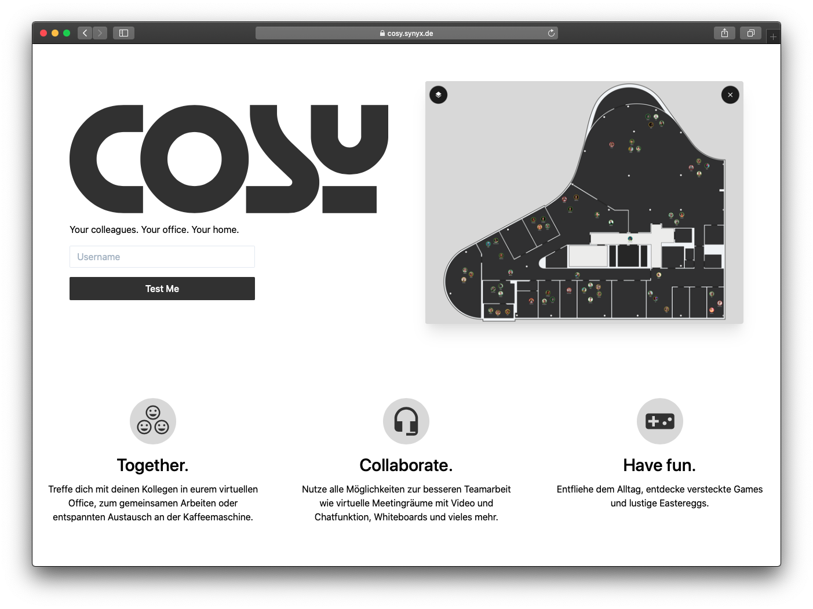

# cosy

Cosy ist als Gimmick für unser gemeinsames monatliches synyx Frühstück entstanden. In Zeiten der remote Arbeit
wollten wir im Mai 2020 das Gefühl schärfen "wieder vor Ort zu sein". Den Kollegen in __unserem__ Büro
auf dem Flur begegnen, sich in der Kaffee Ecke tummeln und sich unterhalten, oder eine Runde am Arcade zocken.

> Disclaimer:  
> Das Projekt wird aktuell nicht aktiv gepflegt. Cosy ist aus der Lust am Programmieren und am
> Lernen entstanden. Es wurden keine fertigen Spiele Engines verwendet und generell viel experimentiert.
> Für eine erste Demo hat es gereicht :-) 

## Run GDevelop Test

Lade GDevelop von https://gdevelop-app.com/download/ herunter. Für Linux ist keine Installation nötig, die
Applikation kommt als AppImage.

Öffne anschließend das Projekt `src/gdevelop/isometric-game.json` und starte es über den Play-Button oben links.

Es steuert sich wie das Original-COSY per Pfeiltasten, die Shift-Taste schaltet den Turbo an. Alternativ kann
man auch mit der Maus navigieren; bei gedrückter Maustaste wandert die Figur in Richtung des Cursor.